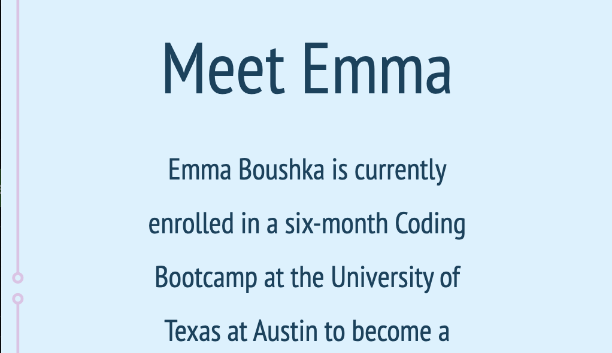
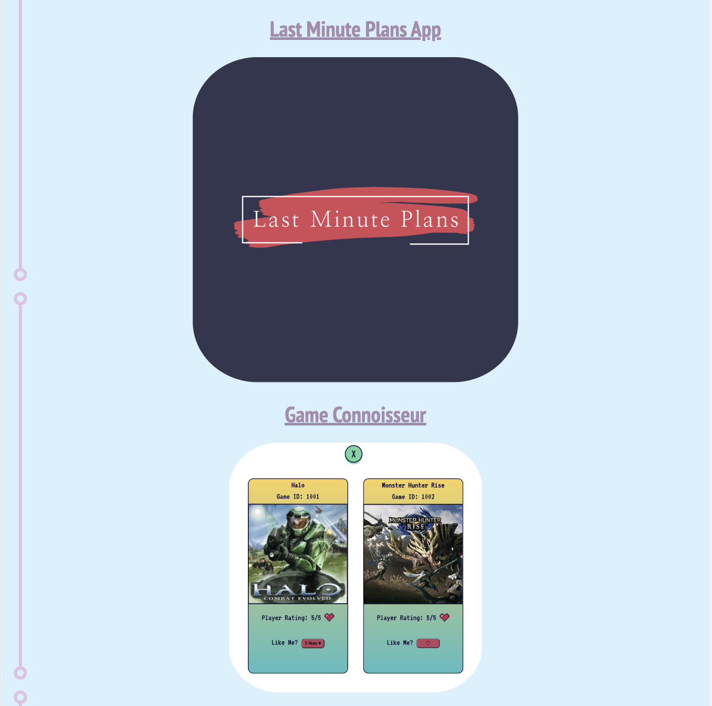

    

---

## 

The purpose of this project was to create a landing page that people can visit to get to know me and my work as a web developer. Included in my landing page is a brief introduction to who I am, how I work, what I value, and (if I do say so myself) a nice picture of me. This is to aid potential employers in gauging what kind of employee and team member I would be. Additionally, Potential employers can access all of my projects on my landing page to see first hand what kind of work I am capable of producing. 

## 

N/A

The site can be accessed from the live URL : https://boushka9.github.io/tiny-pink-lego-frogs/

## 

1. To navigate the site use the four links in the navigation bar under the logo (for smaller screens) or at the top right of the screen (for larger screens). The links will darken as you hover your cursor over them.

2. To read about me and see the accompanying photo of me, click the "About" link.

3. To view preview images projects and to find links to my deployed deployed projects, click the "Projects" tab in the navigation menu.
For smaller screens, the projects will appear stacked in a column with my feature project appearing largest at the top.
For larger screens, the non-feature projects will appear in smaller rows beneath the feature project.

4. To access my contact information, click on the "Contact" tab in the navigation menu. From there you will see links to my email, Github, and phone number at the bottom of the page.

## 

MIT

## 

    
     
    

